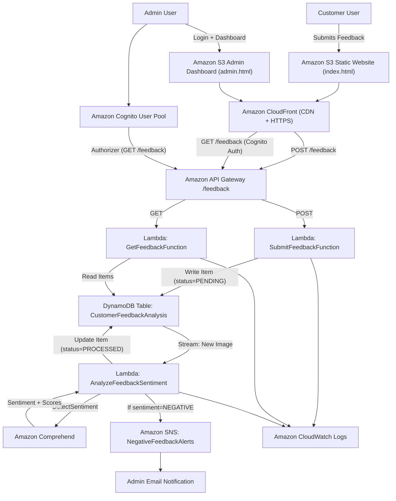

# Comprehend – Customer Feedback Analytics Platform

[](LICENSE)

**Comprehend** is a full-stack **serverless web application** for collecting customer feedback and performing real-time sentiment analysis using AWS.  

It provides:  
- A **public-facing form** for customers to submit feedback  
- An **internal admin dashboard** for analyzing sentiment, status, and trends  

The project demonstrates an AWS-powered pipeline that automatically analyzes feedback using **Amazon Comprehend** and displays results in a user-friendly dashboard. It is ideal for **developers and cloud practitioners** who want to learn how AWS services work together in a serverless architecture.

---

## Table of Contents

- [Features](#features)  
- [Architecture and AWS Services](#architecture-and-aws-services)  
- [Architecture](#architecture)  
- [Data Flow Overview](#data-flow-overview)  
- [Project Structure](#project-structure)  
- [Deployment (Manual Setup Guide)](#deployment-manual-setup-guide)  
  - [Prerequisites](#prerequisites)  
  - [1. Frontend Setup (S3 and CloudFront)](#1-frontend-setup-s3-and-cloudfront)  
  - [2. DynamoDB Setup](#2-dynamodb-setup)  
  - [3. IAM Roles and Permissions](#3-iam-roles-and-permissions)  
  - [4. Lambda Functions Deployment](#4-lambda-functions-deployment)  
  - [5. API Gateway Configuration](#5-api-gateway-configuration)  
  - [6. Amazon Cognito for Admin Authentication](#6-amazon-cognito-for-admin-authentication)  
  - [7. Connecting Components & Final Steps](#7-connecting-components--final-steps)  
- [Usage](#usage)  
- [Future Improvements](#future-improvements)  
- [Contributing](#contributing)  
- [License](#license)  

---

## Features

- **Public Feedback Form** (`index.html`) – Customers submit feedback (status starts as `PENDING`).  
- **Real-Time Sentiment Analysis** – Feedback is automatically analyzed by **Amazon Comprehend** in the background.  
- **Admin Dashboard** (`admin.html`) with:  
  - Cognito login protection  
  - Feedback table with filtering (Status, Sentiment)  
  - Color-coded sentiment highlights  
  - Interactive **Chart.js** charts:
    - Sentiment Distribution (Pie)  
    - Status Overview (Bar)  
    - Feedback Over Time (Line)  
  - Export to CSV  
- **Email Alerts for Negative Feedback** – Implemented with **Amazon SNS**.  
- **Completely Serverless on AWS** – Using S3, CloudFront, API Gateway, Lambda, DynamoDB, Comprehend, Cognito, SNS, and CloudWatch.

---

## Architecture and AWS Services

**High-level architecture:**  
Feedback flows from the **frontend form → API Gateway → Lambda → DynamoDB**.  
A DynamoDB Stream triggers a Lambda to analyze sentiment with Comprehend.  
Results are updated in DynamoDB and shown in the admin dashboard.

### AWS Services Used

- **Amazon S3 + CloudFront** – Static website hosting  
- **Amazon API Gateway** – REST API (`/feedback` resource with POST & GET)  
- **AWS Lambda** – Business logic:
  - `SubmitFeedbackFunction` – Writes feedback into DynamoDB  
  - `GetFeedbackFunction` – Returns all feedback  
  - `AnalyzeFeedbackSentiment` – Processes DynamoDB Stream, calls Comprehend, updates sentiment, publishes to SNS  
- **Amazon DynamoDB** – Stores feedback (`CustomerFeedbackAnalysis` table with partition key `feedback_id`, sort key `date`)  
- **Amazon Comprehend** – Detects sentiment (Positive, Negative, Neutral, Mixed)  
- **Amazon Cognito** – Authentication for admin dashboard  
- **Amazon SNS** – Email alerts for negative feedback  
- **Amazon CloudWatch** – Logging and monitoring  
- **IAM** – Execution role (`LambdaFeedbackRole`) with least-privilege policies  

---

## Architecture

The system uses AWS serverless components to collect feedback, analyze sentiment, and provide admin insights.



---

## Data Flow Overview

1. **Submit feedback** → Frontend calls `POST /feedback` → `SubmitFeedbackFunction` → DynamoDB item (`PENDING`).  
2. **DynamoDB Stream triggers** → `AnalyzeFeedbackSentiment` → calls Comprehend → updates DynamoDB with sentiment → sends SNS alert if negative.  
3. **Admin views dashboard** → Frontend calls `GET /feedback` → `GetFeedbackFunction` → DynamoDB query → results displayed with charts.  

**Example DynamoDB Item (after processing):**
```json
{
  "feedback_id": "example-12345",
  "date": "2025-10-01T13:00:00Z",
  "customer_id": "cust001",
  "comment": "I really loved the service and product quality!",
  "status": "PROCESSED",
  "sentiment": "POSITIVE",
  "sentimentScores": {
    "Positive": 0.98,
    "Negative": 0.0,
    "Neutral": 0.01,
    "Mixed": 0.01
  }
}
```

---

## Project Structure

```plaintext
├── frontend/
│   ├── index.html          # Public customer feedback form
│   ├── admin.html          # Admin dashboard (requires Cognito login)
│   └── assets/             # Optional static assets (CSS/JS/images)
├── lambda/
│   ├── submit_feedback.py  # Lambda for new feedback submissions
│   ├── get_feedback.py     # Lambda for retrieving feedback
│   ├── analyze_feedback.py # Lambda for sentiment analysis + SNS alerts
├── test/
│   └── test-feedback.json  # Sample event payload for local testing
├── README.md               # Project documentation (this file)
└── commands.md             # AWS CLI commands & setup notes
```

---

## Deployment (Manual Setup Guide)

The Comprehend project does not use automated deployment frameworks (IaC) like CloudFormation or SAM; instead, the infrastructure can be set up manually via the AWS Management Console or AWS CLI.  

### Prerequisites
- AWS Account with permissions for S3, DynamoDB, Lambda, API Gateway, Cognito, SNS  
- AWS CLI configured (`aws configure`)  
- Region: recommended **eu-central-1** (Frankfurt)  
- (Optional) Cognito User Pool for admin users  

### 1. Frontend Setup (S3 and CloudFront)
- Create S3 bucket → Enable static website hosting  
- Upload `index.html` & `admin.html`  
- Add bucket policy for public read  
- (Optional) Create CloudFront distribution for HTTPS/CDN  

### 2. DynamoDB Setup
- Create table `CustomerFeedbackAnalysis`  
  - Partition key: `feedback_id` (String)  
  - Sort key: `date` (String)  
- Enable **Streams (New Image)** → copy Stream ARN  

### 3. IAM Roles and Permissions
- Create `LambdaFeedbackRole`  
- Attach policies:
  - `AmazonDynamoDBFullAccess` (demo, restrict later)  
  - `ComprehendFullAccess`  
  - `sns:Publish` for your SNS topic ARN  
  - CloudWatch logging (basic execution role)  

### 4. Lambda Functions Deployment
- Zip & upload code from `lambda/`  
- Functions:
  - `SubmitFeedbackFunction` → writes to DynamoDB  
  - `GetFeedbackFunction` → reads from DynamoDB  
  - `AnalyzeFeedbackSentiment` → triggered by DynamoDB Stream, calls Comprehend & SNS  
- Connect DynamoDB Stream to `AnalyzeFeedbackSentiment`  

### 5. API Gateway Configuration
- Create REST API `FeedbackAPI`  
- Resource `/feedback` with methods:
  - POST → `SubmitFeedbackFunction`  
  - GET → `GetFeedbackFunction` (secured with Cognito Authorizer)  
- Enable **CORS**  
- Deploy to stage (`dev` or `prod`)  

### 6. Amazon Cognito for Admin Authentication
- Create **User Pool** (e.g., `FeedbackAdminPool`)  
- Create App Client (no secret for browser apps)  
- Add admin users  
- Protect `GET /feedback` with Cognito Authorizer  

### 7. Connecting Components & Final Steps
- Update `index.html` & `admin.html` with your API endpoint and Cognito config  
- Invalidate CloudFront cache after changes  
- Test end-to-end:
  1. Submit feedback → DynamoDB → analyzed by Comprehend  
  2. Admin login → view processed data with charts  
  3. Negative feedback → SNS email alert  

---

## Usage

- **Submit feedback** at `index.html` (public)  
- **Review dashboard** at `admin.html` (Cognito login required)  
- **Filter data** by sentiment/status  
- **Export CSV** for offline analysis  
- **Receive email alerts** for negative feedback via SNS  

---

## Future Improvements

- Infrastructure as Code (CloudFormation/SAM/CDK)  
- Unit tests & CloudWatch alarms  
- Retry & DLQ handling for Lambdas  
- Stronger IAM least privilege policies  
- CAPTCHA for public feedback form  
- Multi-language sentiment analysis  
- UI/UX enhancements (React/Angular, richer charts)  
- Automated email responses via SES  

---

## Contributing

Contributions are welcome!  

- Fork this repo, create a feature branch, and open a Pull Request  
- Follow PEP8 coding standards for Python  
- Keep documentation updated if your change affects setup/usage  
- Use clear commit messages  

---

## License

This project is licensed under the **MIT License**.  

See the [LICENSE](LICENSE) file for full details.  

---
